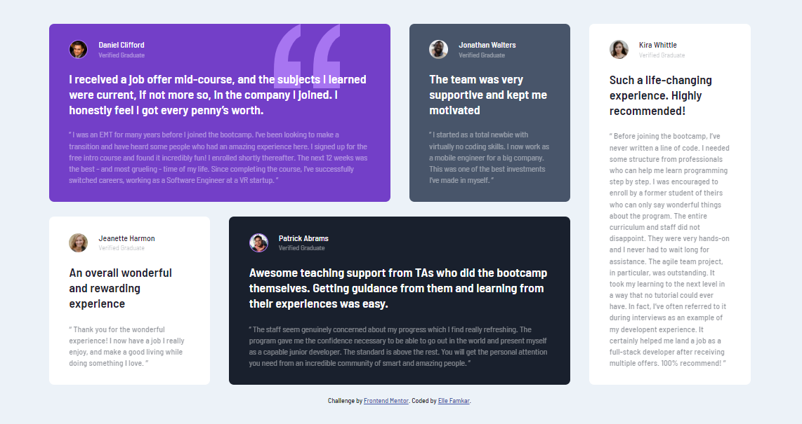
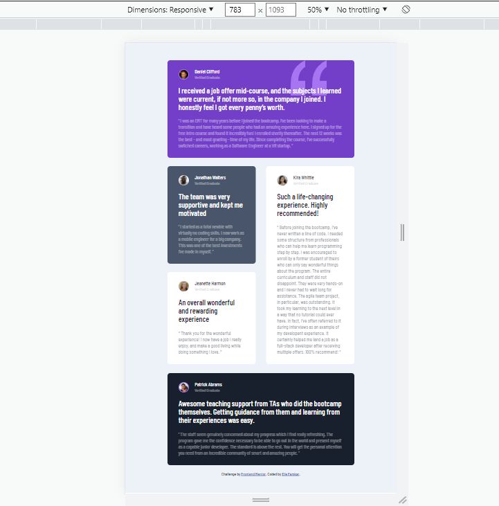
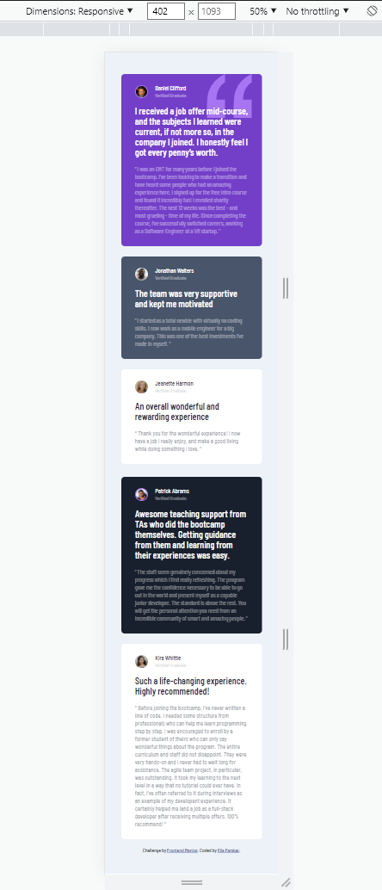

# Frontend Mentor - Testimonials grid section solution

## Welcome to my project guys! 👋

## Table of contents

- [Overview](#overview)
  - [The challenge](#the-challenge)
  - [Screenshot](#screenshot)
  - [Links](#links)
- [My process](#my-process)
  - [Built with](#built-with)
  - [What I learned](#what-i-learned)
  - [Continued development](#continued-development)
  - [Useful resources](#useful-resources)
- [Author](#author)
- [Acknowledgments](#acknowledgments)

## Overview

Thanks for checking out this front-end project which was inspired by [Frontend Mentor](https://www.frontendmentor.io) and i did the best i could to provide you with the cleanest and accurate codes for different devices. I hope this challenge codings help you improve your coding skills by building realistic projects.

Remember that "Every day is a learning day", so let's checkout the requirements to start such project.

### The challenge

In his project you should be able to:

- View the optimal layout for testimonials for the site depending on your device's screen size

### Screenshot





### Links

- Solution URL: [Testimonials grid section](https://ellefamkar.github.io/Testimonials/)
- Live Site URL: [Testimonials grid section](https://ellefamkar.github.io/Testimonials/)

## My process

### Where to find resources

We know what we need first, yes! you are right, the design file. So let's checkout [Fimga](https://www.figma.com/file/LKDNZrbcgHZxY0NTAUtdFk/testimonials-grid-section) to find even the smallest details about the style requirements of this project such as `font-size`, `padding` and `margin` as well as finding all the required assets in the `/images` folder. The assets are already optimized. `color palette` is also available in figma file to guide you to choose the accurate colors.

### Built with

- Semantic HTML5 markup
- CSS custom properties
- Flexbox
- CSS Grid
- Desktop-first workflow

You can use any tools you like to help you complete the project. So if you got something you'd like to practice, feel free to give it a try. However, i wrote this design with simple html5 and css along with bootstrap and js and made it responsive for all the devices, since my users should be able to: View the optimal layout and hover or active states depending on their device's screen size. 

### What I learned

This projects helped me becoming more familiar with the details of html, css and specially grid layout and i was able to use my grid knowledge to create a responsive project with small details on colors,sizes and so on. It was a great experience to built such a fun and simple project.

To see parts of my codes and see how you can add code snippets, see below:

```html
 <div class="grid__item first-item light-color">
            <div class="quote"></div>
            <div class="item__image-container">
               <div class="item__image image-border"></div>
               <div class="item__writer-details">
                  <p class="item__writer">Daniel Clifford</p>
                  <p class="item__qualification">Verified Graduate</p>
               </div>
            </div>
            <p class="item__content">I received a job offer mid-course, and the subjects I learned were current, if not more so, in the company I joined. I honestly feel I got every penny’s worth.</p>
            <p class="item__quote">
               “ I was an EMT for many years before I joined the bootcamp. I’ve been looking to make a transition and have heard some people who had an amazing experience here. I signed up for the free intro course and found it incredibly fun! I enrolled shortly thereafter. The next 12 weeks was the
               best - and most grueling - time of my life. Since completing the course, I’ve successfully switched careers, working as a Software Engineer at a VR startup. ”
            </p>
         </div>
```
```css

.grid__container {
   display: grid;
   column-gap: 30px;
   row-gap: 24px;
   grid-template-columns: repeat(4, 1fr);
   grid-template-areas:
      "first-item first-item second-item third-item"
      "fourth-item fifth-item fifth-item third-item";
}
```
```js
const proudOfThisFunc = () => {
  console.log(` we don't have js in this project yet`)
}
```
### Continued development

In my future projects, not only i am going to focus on improving my basic knowledge of front end development (html and css), but also i will make it more dynamic and use javascript so as to create cooler projects. I will also try to be much more familiar with UI design so as to better understand my clients needs and requirements.
### Useful resources

In order to do this project in a correct way you need to have a good knowledge of html and css especially flex and grid.However, this is possible to built it with other coding systems as well, e.g use bootstrap. so let's master at them with these fruitful resources.

- [w3schools - grid css](https://www.w3schools.com/css/css_grid.asp)
- [css tricks - grid css](https://css-tricks.com/snippets/css/complete-guide-grid/)
- [Learn css grid - grid css](hhttps://learncssgrid.com/)

To my persian friends:
You can benefit from this complete article on which sources to use to master flex and grid.

- [Elle Famkar - Compelete tutorial on css grid](https://vrgl.ir/2alVC) 

You can also learn from this article how to write codes in appropreate style
- [Elle Famkar - CSS Methodologies](https://vrgl.ir/aXv0F) 


# Author

- Website - My website is under construction but you can find my works here : [Elle Famkar](https://github.com/ellefamkar)
- Twitter - [@Ellefamkar](https://www.twitter.com/ellefamkar)

Feel free to ask any questions come to your mind on my github account!

## Acknowledgments

I want to thanks my Frontend mastering course mentor, [Devedoping](https://devedoping.ir/), who has been inspiring and helpfull with great projects, tips and lessons. 


**Have fun using this project!** 🚀